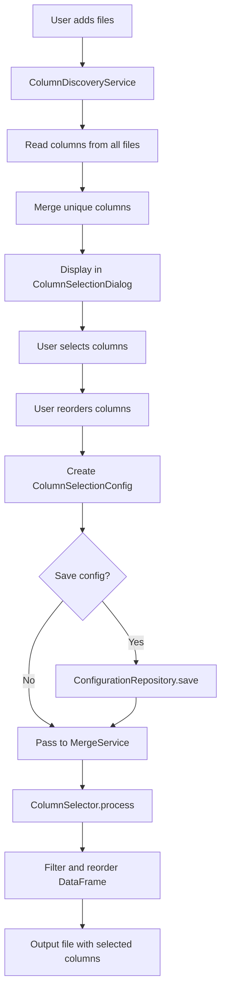

# เอกสารออกแบบ (Design Document)

## ภาพรวม (Overview)

ฟีเจอร์การเลือกคอลัมน์สำหรับการรวมไฟล์เป็นการขยายความสามารถของระบบ Excel Merger Pro ให้ผู้ใช้สามารถควบคุมได้ว่าต้องการนำคอลัมน์ใดบ้างจากไฟล์ต้นทางมารวมในไฟล์ผลลัพธ์ ฟีเจอร์นี้จะช่วยลดขนาดไฟล์ผลลัพธ์ เพิ่มความเร็วในการประมวลผล และทำให้ข้อมูลที่ได้มีเฉพาะส่วนที่จำเป็นต่อการวิเคราะห์

### วัตถุประสงค์

1. ให้ผู้ใช้สามารถเลือกคอลัมน์ที่ต้องการรวมได้อย่างยืดหยุ่น
2. รองรับการจัดเรียงลำดับคอลัมน์ตามความต้องการ
3. จัดการกรณีที่ไฟล์ต่างๆ มีคอลัมน์ไม่ตรงกัน
4. บันทึกและโหลดการตั้งค่าการเลือกคอลัมน์เพื่อใช้ซ้ำ
5. รักษาความเข้ากันได้กับระบบเดิมที่มีอยู่

### ขอบเขต

ฟีเจอร์นี้จะทำงานร่วมกับระบบการรวมไฟล์ที่มีอยู่แล้ว โดยเพิ่มขั้นตอนการเลือกคอลัมน์ก่อนการรวมไฟล์ ระบบจะ:

- แสดงรายการคอลัมน์ทั้งหมดจากไฟล์ต้นทางทุกไฟล์
- ให้ผู้ใช้เลือกคอลัมน์ที่ต้องการ
- ให้ผู้ใช้จัดเรียงลำดับคอลัมน์
- บันทึกการตั้งค่าเป็นไฟล์ JSON
- ใช้การตั้งค่าในการรวมไฟล์

ฟีเจอร์นี้จะไม่:

- เปลี่ยนแปลงข้อมูลในไฟล์ต้นทาง
- แก้ไขชื่อคอลัมน์หรือแปลงข้อมูล
- รวมคอลัมน์ที่มีชื่อต่างกัน

## สถาปัตยกรรม (Architecture)

### ภาพรวมสถาปัตยกรรม

ระบบใช้ Clean Architecture แบ่งเป็น 4 ชั้น:

```
┌─────────────────────────────────────────────────────────┐
│                    UI Layer                              │
│  - ColumnSelectionDialog (PyQt6)                        │
│  - Column list display with checkboxes                  │
│  - Drag-and-drop for reordering                         │
│  - Save/Load buttons                                     │
└─────────────────────────────────────────────────────────┘
                          │
                          ▼
┌─────────────────────────────────────────────────────────┐
│              Application Layer                           │
│  - ColumnDiscoveryService                               │
│  - ColumnSelectionService                               │
│  - MergeService (enhanced)                              │
└─────────────────────────────────────────────────────────┘
                          │
                          ▼
┌─────────────────────────────────────────────────────────┐
│                 Domain Layer                             │
│  - ColumnSelectionConfig (value object)                 │
│  - ColumnMetadata (entity)                              │
│  - ProcessingOptions (enhanced)                         │
└─────────────────────────────────────────────────────────┘
                          │
                          ▼
┌─────────────────────────────────────────────────────────┐
│            Infrastructure Layer                          │
│  - ColumnSelector (data processor)                      │
│  - ConfigurationRepository                              │
│  - ExcelReader (enhanced)                               │
└─────────────────────────────────────────────────────────┘
```

### การไหลของข้อมูล

1. **การค้นหาคอลัมน์**: ผู้ใช้เพิ่มไฟล์ → ColumnDiscoveryService อ่านคอลัมน์จากทุกไฟล์ → แสดงรายการคอลัมน์ใน UI
2. **การเลือกคอลัมน์**: ผู้ใช้เลือกคอลัมน์ → UI สร้าง ColumnSelectionConfig → ส่งไปยัง MergeService
3. **การรวมไฟล์**: MergeService รับ ColumnSelectionConfig → ส่งต่อไปยัง ColumnSelector → กรองคอลัมน์ตามที่เลือก
4. **การบันทึก/โหลด**: ผู้ใช้บันทึกการตั้งค่า → ConfigurationRepository เขียนไฟล์ JSON → โหลดกลับมาใช้ได้

### การบูรณาการกับระบบเดิม

ฟีเจอร์นี้จะบูรณาการกับระบบเดิมโดย:

- ขยาย `ProcessingOptions` ให้รองรับ `ColumnSelectionConfig`
- ใช้ `ColumnSelector` ที่มีอยู่แล้วใน data processors
- เพิ่ม dialog ใหม่ใน UI layer
- เพิ่ม service ใหม่ใน application layer

## ส่วนประกอบและอินเทอร์เฟซ (Components and Interfaces)

### 1. UI Layer

#### ColumnSelectionDialog

Dialog สำหรับให้ผู้ใช้เลือกคอลัมน์และจัดเรียงลำดับ

```python
class ColumnSelectionDialog(QDialog):
    """
    Dialog for selecting and ordering columns for merge operation
    
    Features:
    - Display all available columns from source files
    - Checkbox selection for each column
    - Drag-and-drop reordering
    - Select all / Deselect all buttons
    - Save / Load configuration
    """
    
    def __init__(
        self,
        available_columns: List[ColumnMetadata],
        parent=None
    ):
        """
        Initialize dialog with available columns
        
        Args:
            available_columns: List of columns discovered from source files
            parent: Parent widget
        """
        pass
    
    def get_selection_config(self) -> Optional[ColumnSelectionConfig]:
        """
        Get the column selection configuration from user input
        
        Returns:
            ColumnSelectionConfig if user confirmed, None if cancelled
        """
        pass
    
    def load_configuration(self, config: ColumnSelectionConfig):
        """
        Load saved configuration into dialog
        
        Args:
            config: Previously saved column selection configuration
        """
        pass
```

### 2. Application Layer

#### ColumnDiscoveryService

Service สำหรับค้นหาคอลัมน์จากไฟล์ต้นทาง

```python
class ColumnDiscoveryService:
    """
    Service for discovering available columns from source files
    
    Responsibilities:
    - Read column names from all source files
    - Merge column lists from multiple files
    - Handle duplicate column names
    - Detect header rows
    """
    
    def __init__(self, reader: ISheetReader, logger: ILogger):
        """
        Initialize service with dependencies
        
        Args:
            reader: Sheet reader for accessing Excel files
            logger: Logger for operation tracking
        """
        self.reader = reader
        self.logger = logger
    
    def discover_columns(
        self,
        files: List[SourceFile]
    ) -> List[ColumnMetadata]:
        """
        Discover all unique columns from source files
        
        Args:
            files: List of source files to analyze
        
        Returns:
            List of unique columns with metadata
        """
        pass
```

#### ColumnSelectionService

Service สำหรับจัดการการเลือกคอลัมน์และการตั้งค่า

```python
class ColumnSelectionService:
    """
    Service for managing column selection configurations
    
    Responsibilities:
    - Validate column selections
    - Save/load configurations
    - Apply default selections
    """
    
    def __init__(
        self,
        repository: IConfigurationRepository,
        logger: ILogger
    ):
        """
        Initialize service with dependencies
        
        Args:
            repository: Repository for persisting configurations
            logger: Logger for operation tracking
        """
        self.repository = repository
        self.logger = logger
    
    def create_config(
        self,
        selected_columns: List[str],
        column_order: List[str]
    ) -> ColumnSelectionConfig:
        """
        Create and validate column selection configuration
        
        Args:
            selected_columns: List of selected column names
            column_order: Ordered list of column names
        
        Returns:
            Validated ColumnSelectionConfig
        
        Raises:
            ValueError: If configuration is invalid
        """
        pass
    
    def save_config(
        self,
        config: ColumnSelectionConfig,
        name: str
    ) -> None:
        """
        Save configuration with a name
        
        Args:
            config: Configuration to save
            name: Name for the configuration
        """
        pass
    
    def load_config(self, name: str) -> ColumnSelectionConfig:
        """
        Load saved configuration by name
        
        Args:
            name: Name of the configuration
        
        Returns:
            Loaded configuration
        
        Raises:
            FileNotFoundError: If configuration not found
        """
        pass
    
    def get_default_config(
        self,
        available_columns: List[str]
    ) -> ColumnSelectionConfig:
        """
        Create default configuration (all columns selected)
        
        Args:
            available_columns: List of available column names
        
        Returns:
            Default configuration with all columns selected
        """
        pass
```

### 3. Domain Layer

#### ColumnMetadata

Entity สำหรับเก็บข้อมูลเกี่ยวกับคอลัมน์

```python
@dataclass
class ColumnMetadata:
    """
    Metadata about a column discovered from source files
    
    Attributes:
        name: Column name (from header or letter like 'A', 'B')
        source_files: List of files containing this column
        is_from_header: Whether name comes from header row
        data_type: Detected data type (optional)
    """
    name: str
    source_files: List[str]
    is_from_header: bool
    data_type: Optional[str] = None
    
    def __post_init__(self):
        """Validate column metadata"""
        if not self.name:
            raise ValueError("Column name cannot be empty")
        if not self.source_files:
            raise ValueError("Column must have at least one source file")
```

### 4. Infrastructure Layer

#### IConfigurationRepository

Interface สำหรับบันทึกและโหลดการตั้งค่า

```python
class IConfigurationRepository(ABC):
    """
    Repository interface for persisting column selection configurations
    """
    
    @abstractmethod
    def save(self, config: ColumnSelectionConfig, name: str) -> None:
        """
        Save configuration with a name
        
        Args:
            config: Configuration to save
            name: Name for the configuration
        """
        pass
    
    @abstractmethod
    def load(self, name: str) -> ColumnSelectionConfig:
        """
        Load configuration by name
        
        Args:
            name: Name of the configuration
        
        Returns:
            Loaded configuration
        
        Raises:
            FileNotFoundError: If configuration not found
        """
        pass
    
    @abstractmethod
    def list_saved_configs(self) -> List[str]:
        """
        List all saved configuration names
        
        Returns:
            List of configuration names
        """
        pass
    
    @abstractmethod
    def delete(self, name: str) -> None:
        """
        Delete saved configuration
        
        Args:
            name: Name of the configuration to delete
        """
        pass
```

#### JsonConfigurationRepository

Implementation ของ repository ที่บันทึกเป็นไฟล์ JSON

```python
class JsonConfigurationRepository(IConfigurationRepository):
    """
    JSON file-based implementation of configuration repository
    
    Saves configurations as JSON files in a designated directory
    """
    
    def __init__(self, config_dir: Path):
        """
        Initialize repository with configuration directory
        
        Args:
            config_dir: Directory for storing configuration files
        """
        self.config_dir = config_dir
        self.config_dir.mkdir(parents=True, exist_ok=True)
```

## โมเดลข้อมูล (Data Models)

### ColumnSelectionConfig

Value object สำหรับเก็บการตั้งค่าการเลือกคอลัมน์ (มีอยู่แล้วใน `processing_options.py`)

```python
@dataclass(frozen=True)
class ColumnSelectionConfig:
    """
    Configuration for column selection and reordering
    
    Invariants:
    - selected_columns cannot be empty
    - column_order must contain exactly the selected_columns
    - No duplicate column names
    """
    selected_columns: Tuple[str, ...]
    column_order: Tuple[str, ...]
    
    def __post_init__(self):
        """Validate invariants"""
        if not self.selected_columns:
            raise ValueError("selected_columns cannot be empty")
        
        if set(self.column_order) != set(self.selected_columns):
            raise ValueError(
                "column_order must contain exactly the selected_columns"
            )
        
        if len(set(self.selected_columns)) != len(self.selected_columns):
            raise ValueError("selected_columns contains duplicates")
```

### ColumnMetadata

Entity สำหรับเก็บข้อมูลเกี่ยวกับคอลัมน์ที่ค้นพบ

```python
@dataclass
class ColumnMetadata:
    """
    Metadata about a column discovered from source files
    
    Attributes:
        name: Column name
        source_files: Files containing this column
        is_from_header: Whether name is from header row
        data_type: Detected data type (optional)
    """
    name: str
    source_files: List[str]
    is_from_header: bool
    data_type: Optional[str] = None
```

### Configuration File Format

รูปแบบไฟล์ JSON สำหรับบันทึกการตั้งค่า:

```json
{
  "name": "sales_report_columns",
  "version": "1.0",
  "created_at": "2024-01-15T10:30:00",
  "config": {
    "selected_columns": ["Date", "Product", "Amount", "Customer"],
    "column_order": ["Date", "Customer", "Product", "Amount"]
  }
}
```

### Data Flow Diagram




## Correctness Properties

*A property is a characteristic or behavior that should hold true across all valid executions of a system-essentially, a formal statement about what the system should do. Properties serve as the bridge between human-readable specifications and machine-verifiable correctness guarantees.*

### Property 1: Column Discovery Completeness

*For any* source file with N columns, the column discovery service should return exactly N unique column names.

**Validates: Requirements 1.1**

### Property 2: Header Row Name Usage

*For any* source file with a header row, all discovered column names should match the values in the header row.

**Validates: Requirements 1.2**

### Property 3: Letter-Based Column Names

*For any* source file without a header row, all discovered column names should be alphabetic letters (A, B, C, ..., Z, AA, AB, ...).

**Validates: Requirements 1.3**

### Property 4: Multi-File Column Uniqueness

*For any* set of source files, the combined list of discovered columns should contain each unique column name exactly once, regardless of how many files contain that column.

**Validates: Requirements 1.4, 8.1**

### Property 5: Multiple Column Selection

*For any* subset of available columns, the column selector should allow selecting all columns in that subset simultaneously.

**Validates: Requirements 2.2**

### Property 6: Selection Toggle Round Trip

*For any* column, selecting it and then deselecting it should result in the column not being in the selected list.

**Validates: Requirements 2.3**

### Property 7: Selection State Visibility

*For any* column, after selecting it, querying its selection state should return true; after deselecting it, querying should return false.

**Validates: Requirements 2.4**

### Property 8: Selection Persistence

*For any* set of selected columns, the column selector should maintain that selection until explicitly changed by the user.

**Validates: Requirements 2.5**

### Property 9: Select All Completeness

*For any* set of available columns, calling select_all should result in all columns being in the selected list.

**Validates: Requirements 3.1, 3.2**

### Property 10: Deselect All Emptiness

*For any* current selection state, calling deselect_all should result in an empty selection list.

**Validates: Requirements 3.3, 3.4**

### Property 11: Output Column Filtering

*For any* column selection configuration and set of source files, the merged output should contain only the columns specified in the selection, and no other columns (except system-added columns like Origin_File).

**Validates: Requirements 4.2, 4.5**

### Property 12: Output Column Ordering

*For any* column order specification in the configuration, the columns in the merged output should appear in exactly that order.

**Validates: Requirements 4.3, 7.4**

### Property 13: Missing Column Handling

*For any* selected column that doesn't exist in a source file, the merged output should include that column with null/empty values for rows from that file.

**Validates: Requirements 4.4**

### Property 14: Configuration Serialization Round Trip

*For any* valid column selection configuration, saving it to a file and then loading it back should produce an equivalent configuration.

**Validates: Requirements 6.2, 6.4**

### Property 15: Configuration Column Filtering

*For any* saved configuration with column names, when loaded with a different set of available columns, only the columns that exist in both the configuration and the available columns should be selected.

**Validates: Requirements 6.5**

### Property 16: Column Reordering

*For any* two distinct orderings of the same set of selected columns, changing from one ordering to another should result in the configuration reflecting the new ordering.

**Validates: Requirements 7.1, 7.3**

### Property 17: Column Order Display Consistency

*For any* column selection configuration, the displayed order should match the order stored in the configuration.

**Validates: Requirements 7.2**

### Property 18: Duplicate Column Name Merging

*For any* set of source files containing columns with the same name, when that column is selected, the merged output should include data from all files with that column name.

**Validates: Requirements 8.2**

### Property 19: Name-Based Column Matching

*For any* two source files with a column of the same name but different positions, the merger should match them by name, not by position.

**Validates: Requirements 8.3**

## Error Handling

### Validation Errors

1. **Empty Column Selection**: When attempting to create a `ColumnSelectionConfig` with an empty selection, the system should raise a `ValueError` with a clear message.

2. **Mismatched Column Order**: When the `column_order` doesn't match the `selected_columns`, the system should raise a `ValueError` explaining the mismatch.

3. **Duplicate Column Names**: When `selected_columns` contains duplicates, the system should raise a `ValueError`.

4. **Invalid Column Names**: When a column name in the selection doesn't exist in any source file, the system should log a warning but continue processing (creating empty columns).

### File I/O Errors

1. **Configuration File Not Found**: When loading a non-existent configuration, the system should raise a `FileNotFoundError` with the configuration name.

2. **Invalid Configuration Format**: When loading a configuration file with invalid JSON or missing required fields, the system should raise a `ValueError` with details about the format error.

3. **Permission Errors**: When unable to save a configuration due to file system permissions, the system should raise a `PermissionError` with a user-friendly message.

### Runtime Errors

1. **Cancellation During Discovery**: If the user cancels during column discovery, the system should stop immediately and clean up any partial results.

2. **Memory Errors**: If column discovery fails due to memory constraints (very large files), the system should fall back to reading only the first row for column names.

### Error Recovery

1. **Partial Column Availability**: If some selected columns are missing from source files, the system should continue processing and create empty columns for the missing ones.

2. **Configuration Migration**: If loading an old configuration format, the system should attempt to migrate it to the current format or provide a clear error message.

## Testing Strategy

### Dual Testing Approach

ฟีเจอร์นี้จะใช้การทดสอบแบบผสมผสานระหว่าง unit tests และ property-based tests:

- **Unit tests**: ทดสอบกรณีเฉพาะเจาะจง เช่น การเลือกคอลัมน์เดียว, การบันทึก/โหลด config ที่มีชื่อเฉพาะ, error cases
- **Property tests**: ทดสอบ properties ที่ต้องเป็นจริงกับข้อมูลทุกชุด เช่น round trip properties, invariants

### Property-Based Testing Configuration

ใช้ไลบรารี **Hypothesis** สำหรับ Python property-based testing:

```python
from hypothesis import given, strategies as st
import hypothesis.strategies as st

# Example property test
@given(
    columns=st.lists(
        st.text(min_size=1, max_size=20),
        min_size=1,
        max_size=50,
        unique=True
    )
)
def test_select_all_completeness(columns):
    """
    Feature: column-selection-for-merge, Property 9:
    For any set of available columns, calling select_all 
    should result in all columns being in the selected list.
    """
    selector = ColumnSelector(available_columns=columns)
    selector.select_all()
    
    assert set(selector.get_selected()) == set(columns)
```

**Configuration**:
- จำนวน iterations ขั้นต่ำ: 100 ครั้งต่อ property test
- แต่ละ property test จะมี comment tag อ้างอิงถึง property ในเอกสารนี้
- Format: `Feature: column-selection-for-merge, Property {number}: {property_text}`

### Test Coverage Areas

#### 1. Column Discovery Tests

**Unit Tests**:
- ทดสอบการอ่านคอลัมน์จากไฟล์ที่มี header
- ทดสอบการอ่านคอลัมน์จากไฟล์ที่ไม่มี header
- ทดสอบการรวมคอลัมน์จากไฟล์เดียว
- ทดสอบ error cases (ไฟล์เสีย, ไฟล์ว่าง)

**Property Tests**:
- Property 1: Column Discovery Completeness
- Property 2: Header Row Name Usage
- Property 3: Letter-Based Column Names
- Property 4: Multi-File Column Uniqueness

#### 2. Column Selection Tests

**Unit Tests**:
- ทดสอบการเลือกคอลัมน์เดียว
- ทดสอบการยกเลิกการเลือกคอลัมน์เดียว
- ทดสอบ error cases (เลือกคอลัมน์ที่ไม่มี)

**Property Tests**:
- Property 5: Multiple Column Selection
- Property 6: Selection Toggle Round Trip
- Property 7: Selection State Visibility
- Property 8: Selection Persistence
- Property 9: Select All Completeness
- Property 10: Deselect All Emptiness

#### 3. Merge Operation Tests

**Unit Tests**:
- ทดสอบการรวมไฟล์ 2 ไฟล์ด้วยคอลัมน์ที่เลือก
- ทดสอบการรวมไฟล์ที่มีคอลัมน์ไม่ครบ
- ทดสอบ error cases (ไม่มีการเลือกคอลัมน์)

**Property Tests**:
- Property 11: Output Column Filtering
- Property 12: Output Column Ordering
- Property 13: Missing Column Handling
- Property 18: Duplicate Column Name Merging
- Property 19: Name-Based Column Matching

#### 4. Configuration Persistence Tests

**Unit Tests**:
- ทดสอบการบันทึก config ที่มีชื่อเฉพาะ
- ทดสอบการโหลด config ที่มีอยู่
- ทดสอบ error cases (โหลด config ที่ไม่มี, ไฟล์เสีย)

**Property Tests**:
- Property 14: Configuration Serialization Round Trip
- Property 15: Configuration Column Filtering

#### 5. Column Reordering Tests

**Unit Tests**:
- ทดสอบการเปลี่ยนลำดับคอลัมน์ 2 คอลัมน์
- ทดสอบการย้ายคอลัมน์ไปตำแหน่งแรก/สุดท้าย

**Property Tests**:
- Property 16: Column Reordering
- Property 17: Column Order Display Consistency

### Integration Tests

นอกจาก unit และ property tests แล้ว ยังต้องมี integration tests เพื่อทดสอบการทำงานร่วมกันของส่วนประกอบทั้งหมด:

1. **End-to-End Column Selection Flow**:
   - เพิ่มไฟล์ → ค้นหาคอลัมน์ → เลือกคอลัมน์ → รวมไฟล์ → ตรวจสอบผลลัพธ์

2. **Configuration Save/Load Flow**:
   - เลือกคอลัมน์ → บันทึก config → โหลด config → ตรวจสอบว่าการเลือกเหมือนเดิม

3. **Multi-File Merge with Column Selection**:
   - เพิ่มหลายไฟล์ที่มีคอลัมน์ต่างกัน → เลือกคอลัมน์บางส่วน → รวมไฟล์ → ตรวจสอบว่าผลลัพธ์ถูกต้อง

### Performance Tests

ทดสอบประสิทธิภาพในกรณีที่มีข้อมูลจำนวนมาก:

1. **Large Number of Columns**: ทดสอบกับไฟล์ที่มี 1000+ คอลัมน์
2. **Large Number of Files**: ทดสอบกับ 100+ ไฟล์
3. **Large Configuration Files**: ทดสอบการบันทึก/โหลด config ที่มีคอลัมน์จำนวนมาก

### Test Data Generation

ใช้ Hypothesis strategies สำหรับสร้างข้อมูลทดสอบ:

```python
# Strategy for generating column names
column_names = st.text(
    alphabet=st.characters(
        whitelist_categories=('Lu', 'Ll', 'Nd'),
        min_codepoint=32,
        max_codepoint=126
    ),
    min_size=1,
    max_size=50
).filter(lambda x: x.strip())  # No empty or whitespace-only names

# Strategy for generating column lists
column_lists = st.lists(
    column_names,
    min_size=1,
    max_size=100,
    unique=True
)

# Strategy for generating DataFrames
dataframes = st.builds(
    pd.DataFrame,
    data=st.dictionaries(
        keys=column_names,
        values=st.lists(st.integers() | st.floats() | st.text(), min_size=1, max_size=100)
    )
)
```

### Continuous Integration

การทดสอบทั้งหมดจะรันอัตโนมัติใน CI pipeline:

1. **Pre-commit**: รัน unit tests ที่เร็ว
2. **Pull Request**: รัน unit tests + property tests (100 iterations)
3. **Main Branch**: รัน unit tests + property tests (1000 iterations) + integration tests
4. **Nightly**: รัน ทุกอย่าง + performance tests

